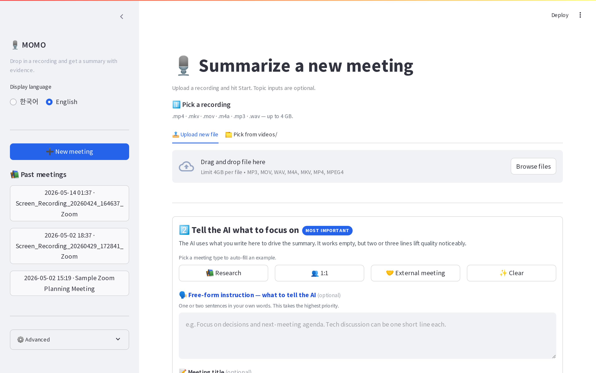
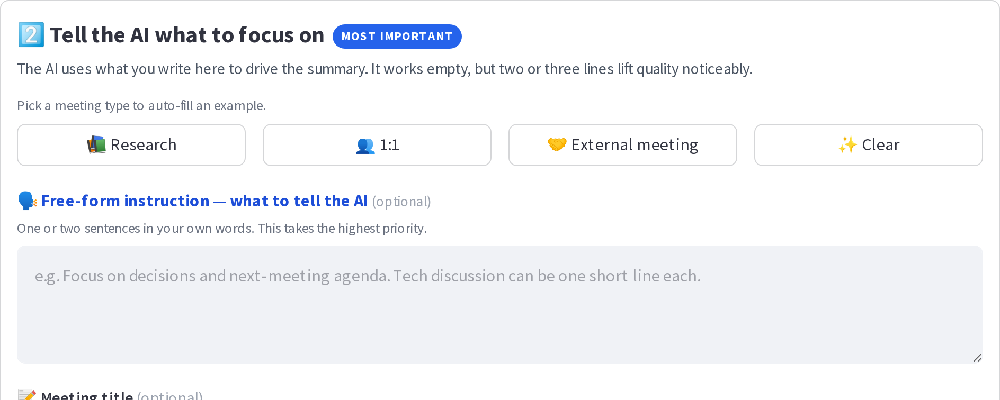
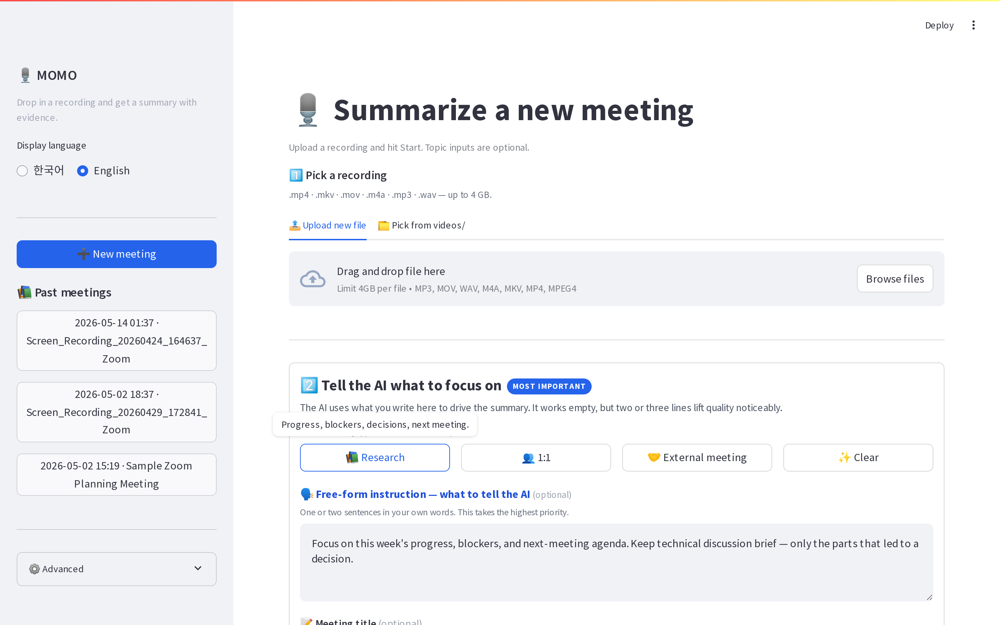
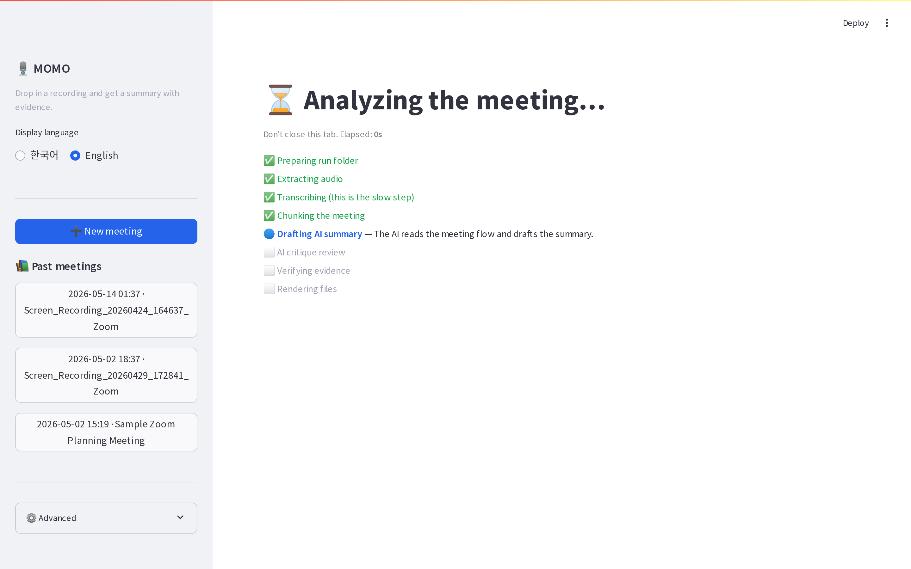
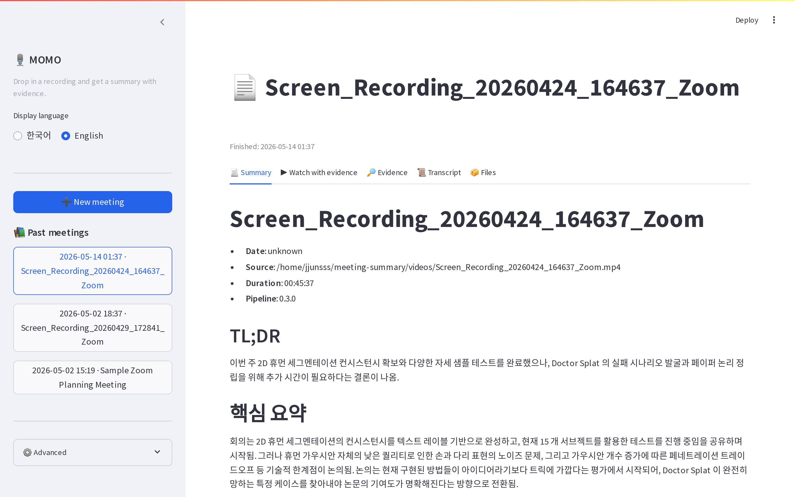
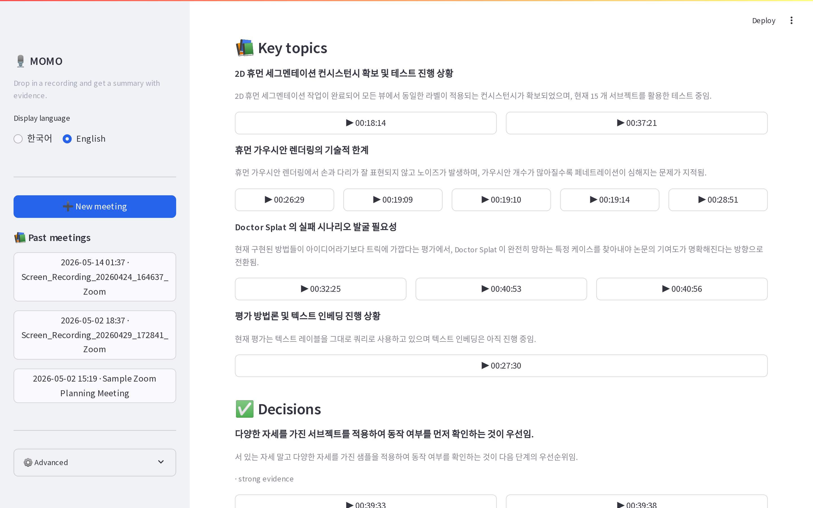

# MOMO

MOMO turns long Zoom recordings into Markdown meeting recaps with
evidence-anchored timestamps. Drop a file, write a few lines about
what you want, click start. Local/server mode runs on your own GPU;
Colab trial mode runs in a temporary hosted GPU runtime.



## What it does

```text
videos/meeting.mp4
        │
        ▼   ffmpeg
audio.wav  (16 kHz mono)
        │
        ▼   Whisper large-v3
raw_transcript.json ── normalize ──▶ normalized_transcript.json
        │
        ▼   chunk (6–10 min, 30 s overlap)
chunks.json
        │
        ▼   rule-based salience pre-pass
chunk_analysis.jsonl   (kept / skipped)
        │
        ▼   LLM: per-slot extraction
        │   (thinking on, JSON schema enforced)
slot_extracts.jsonl
        │
        ▼   LLM: 2-pass summary write  (prose → strict JSON)
final_summary.draft.json
        │
        ▼   LLM: CoVe-style critique  (evidence-anchored verification)
final_summary.json ── deterministic render ──▶ final_summary.md
                                                + summary_evidence.md
```

> Stage table, output artifacts, defaults → [docs/PIPELINE.md](docs/PIPELINE.md)
> Colab trial uses lighter runtime defaults for stability → [docs/COLAB.md](docs/COLAB.md)

## Choose your path

| Path | Best for | Start |
|---|---|---|
| **Colab trial (초보자 / Beginner)** | First-time users who want to try MOMO without touching a server. | [](https://colab.research.google.com/github/jjunsss/MOMO/blob/main/notebooks/MOMO_Colab.ipynb) |
| **Local/server GUI (반복 사용자 / Regular user)** | Repeated use, private recordings, long meetings, and team/shared machines. | `scripts/start-gui.sh` |

Colab runs in a Google-hosted GPU runtime and writes the same `runs/`
artifacts as the local CLI. Use it as the lightweight evaluation path.
For confidential meetings or regular production use, run the local/server
GUI so files and model caches stay on your own machine.

> Colab beginner screenshots → [docs/COLAB.md#beginner-visual-guide](docs/COLAB.md#beginner-visual-guide)

## Local/server requirements

Before installing, the server only needs:

- **Linux**
- **NVIDIA GPU + working NVIDIA driver**
- `nvidia-smi` must run successfully

The shell installer handles the rest when possible:

- `.venv`
- Python 3.10+ (uses existing Python, or installs user-local Python with `uv`)
- `curl`, `ffmpeg`, `python3-venv`, `pip`
- PyTorch CUDA wheels
- Whisper, Streamlit, Ollama, and the default LLM model

Supported system package managers: `apt`, `dnf`, `yum`, `pacman`,
`zypper`, and `apk`. The script may ask for `sudo`.

MOMO does **not** install NVIDIA drivers. Check the GPU first:

```bash
nvidia-smi
```

Docker users also need Docker Compose v2 and NVIDIA Container Toolkit.

## Local/server quick start

```bash
git clone https://github.com/jjunsss/MOMO.git
cd MOMO
scripts/start-gui.sh
```

Open the URL printed by the script, usually **<http://localhost:8501>**.
If `8501` is busy, MOMO automatically tries `8502` through `8510`.
First run downloads a few GB of models; **every later launch is the
same command** and skips the install in seconds.

> Shell and Docker install details → [docs/INSTALL.md](docs/INSTALL.md)

## How to use the local GUI

The interface speaks **Korean and English** (toggle in the sidebar).
Three steps.

### Step 1 — Drop a recording

Upload an `.mp4 / .mkv / .mov / .m4a / .mp3 / .wav` (up to 4 GB), or
pick an existing file from `videos/` in the second tab. The sidebar
lists past runs so you can re-open them without re-running.

### Step 2 — Tell the AI what to focus on (this is the important part)



The bordered panel is where you steer the summary. All four fields are
optional — the free-form instruction has the biggest impact on quality:

| Field | What it does |
|---|---|
| 🗣️ **Free-form instruction** | One or two sentences in your own words. Goes directly into the LLM prompt. |
| 📝 **Meeting title** | Cosmetic label for the report. |
| ⭐ **Topics** | One per line. The AI looks for these and structures the summary around them. |
| ⚠️ **Confusion watch** | One per line. Things the AI must not mix up. |

Don't know what to write? Pick a meeting-type preset and edit:



Three presets: **📚 Research**, **👥 1:1**, **🤝 External meeting**.
They're intentionally narrow because speaker diarization is off — the
pipeline doesn't promise per-speaker attribution.

Click **🚀 Start summarizing**. The pipeline runs locally and shows a
step-by-step progress card:



### Step 3 — Read the result



Five tabs: **📄 Summary** · **▶ Watch with evidence** · **🔎 Evidence**
· **📜 Transcript** · **📦 Files**.

Each topic, decision, and worth-noting item carries the timestamp range
where it appeared. Click any ▶ HH:MM:SS chip on the **Watch with
evidence** tab and the video player re-anchors to that moment — useful
for double-checking the AI's call before pasting the recap into Slack.



> Wall-clock times by mode, language behavior, CLI alternative → [docs/USAGE.md](docs/USAGE.md)

## References

### Research context behind the recap LLM

MOMO uses published ideas as implementation guidance, but not every
paper below is a one-to-one reproduction:

- **Chain-of-Verification (CoVe)-style checking** — Dhuliawala et al.,
  2023. MOMO has a simplified claim-checking pass that verifies draft
  claims against transcript evidence windows.
  ([paper](https://arxiv.org/abs/2309.11495))
- **Chain-of-Thought / reasoning-prompting inspiration** — Wei et al.,
  2022. Slot extraction runs with model thinking enabled while locating
  evidence, then returns constrained JSON.
  ([paper](https://arxiv.org/abs/2201.11903))
- **Recursive decomposition for long documents** — Wu et al. (OpenAI),
  2021. Thorough mode uses chunk/slot decomposition for long meetings;
  it does not use the paper's human-feedback training setup.
  ([paper](https://arxiv.org/abs/2109.10862))
- **Extractive salience background** — TextRank (Mihalcea & Tarau,
  2004) is background for extractive ranking, but MOMO currently uses a
  simpler lexical required-hit/keyword gate, not graph-based TextRank.
  ([paper](https://aclanthology.org/W04-3252/))
- **Meeting summarization context** — QMSum (Zhong et al., 2021)
  motivates query/user-directed meeting summarization.
  ([paper](https://arxiv.org/abs/2104.05938))

> Where each technique lives in the codebase → [docs/REFERENCES.md](docs/REFERENCES.md)

### Tools and models

- OpenAI Whisper: https://github.com/openai/whisper
- Ollama: https://docs.ollama.com/
- PyTorch: https://pytorch.org/get-started/locally/
- Qwen: https://qwen.moe/

Thanks to the teams behind Whisper, Ollama, PyTorch, and Qwen — MOMO
would not exist without these projects.
