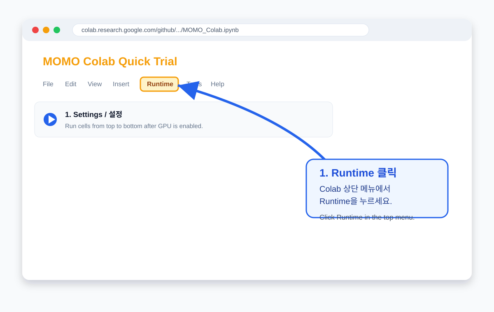
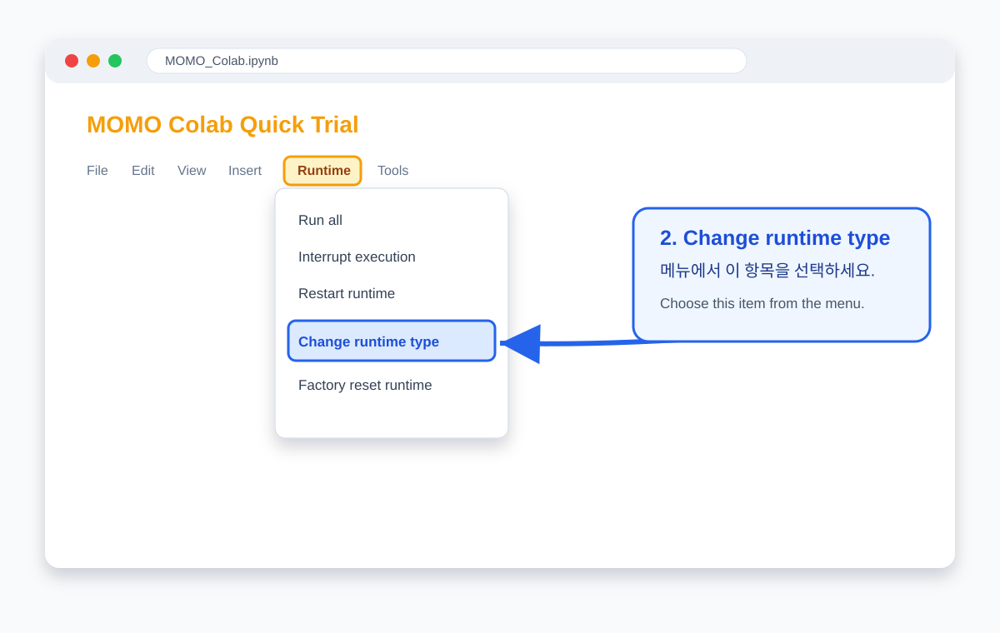
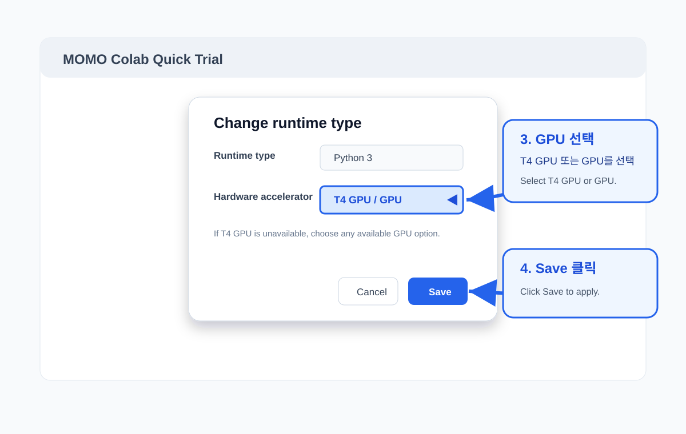
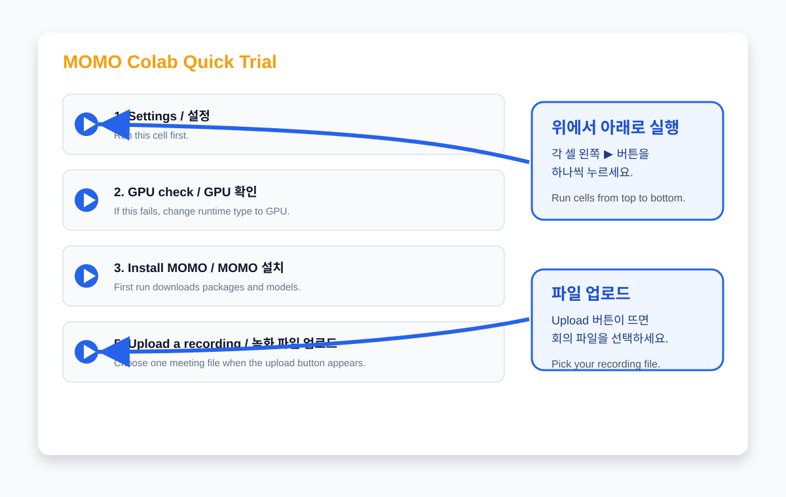

# Colab trial

Use the Colab notebook when someone wants to try MOMO without installing
Docker, Python, CUDA, ffmpeg, or Ollama on their own machine.

[](https://colab.research.google.com/github/jjunsss/MOMO/blob/main/notebooks/MOMO_Colab.ipynb)

## Who this is for

| User type | Recommended path | Why |
|---|---|---|
| First-time evaluator (초보자 / Beginner) | **Colab trial** | Fastest way to upload one recording and inspect the summary quality. |
| Local/server user (반복 사용자 / Regular user) | **GUI install** | Better for repeated use, private files, long meetings, and stable model caches. |

Colab is intentionally a trial path. It uses a temporary Google-hosted
runtime, so model downloads and uploaded files disappear when the
runtime is reset. For confidential recordings, use the local/server GUI.

## Before you run it

1. Open the notebook from the badge above.
2. In Colab, choose **Runtime → Change runtime type → GPU**.
3. Run cells from top to bottom.
4. Upload one `.mp4`, `.mkv`, `.mov`, `.m4a`, `.mp3`, or `.wav`.
5. Edit the topic-details cell if you want meeting-specific focus terms.

The notebook fails early when `torch.cuda.is_available()` is false.
MOMO also configures Whisper with `MOMO_ASR_DEVICE=cuda`, so it does
not silently fall back to CPU transcription.

## Beginner visual guide

If the Colab menu looks slightly different, look for the same words:
**Runtime**, **Change runtime type**, **Hardware accelerator**, **GPU**,
and **Save**.

**한국어**: 초보자는 아래 이미지를 보면서 그대로 따라가면 됩니다.

**English**: Beginners can follow the screenshots below step by step.

### 1. Open the Runtime menu



### 2. Choose Change runtime type



### 3. Select GPU and Save



### 4. Run cells and upload one recording



## Defaults

The Colab notebook uses trial-stable defaults:

- Whisper `medium`
- Ollama `qwen3.5:9b`
- `8192` token LLM context
- PyTorch CUDA 12.4 wheels
- fast LLM summary mode
- AI critique disabled
- Korean output by default

For a slower quality pass, change these notebook variables before
running the pipeline cell. This can take 10+ minutes depending on the
recording length and the Colab GPU, but usually gives better ASR and
more careful summary structure:

```python
ASR_MODEL = "large-v3"
LLM_NUM_CTX = "32768"
SUMMARY_MODE = "thorough"
ENABLE_CRITIQUE = "true"
```

The output language is controlled by:

```python
OUTPUT_LANGUAGE = "ko"  # or "en"
```

## Meeting focus

The **Meeting focus / 회의 요약 조건** cell is where beginners should
edit meeting-specific guidance. You can keep the defaults for a simple
trial, but changing this cell usually improves the summary.

**한국어**: 코드를 몰라도 따옴표 안의 글자만 바꾸면 됩니다. 가장
중요한 항목은 `custom_instruction`입니다.

| Field | What to edit |
|---|---|
| `title` | Meeting title shown in the output. |
| `custom_instruction` | Most important. One or two sentences about what MOMO should prioritize. |
| `topics` | Topics MOMO should actively look for. |
| `must_check` | Caution rules, such as not inventing dates or preserving English technical names. |
| `output_language` | Output language inherited from `OUTPUT_LANGUAGE`. |

## Outputs

The final cell displays
`/content/momo_workspace/runs/{run_id}/summaries/final_summary.md` and
downloads a zip with the most useful artifacts:

- final Markdown summary
- final JSON summary
- evidence report
- normalized transcript Markdown

These are the same artifacts produced by the local CLI and GUI.

## Troubleshooting

**GPU is OFF**

Use **Runtime → Change runtime type → GPU**, then run the notebook again.
Free Colab GPU availability varies by account and time.

**Ollama did not start**

The notebook installs Ollama from the Linux archive package, not from
`curl ... install.sh`. Restart the Colab runtime and rerun from the top.
If it fails again, check `/tmp/momo_ollama.log` in the notebook. If the
download itself fails, rerun the Ollama cell once; Colab/network
transient failures are common during large downloads.

**Model pull is slow**

The first run downloads several GB. Colab runtimes are temporary, so the
download may repeat after a reset. Local/server installs cache models
more reliably.

**Upload is slow or the meeting is very long**

Use the local/server GUI. Browser uploads and temporary Colab disks are
not ideal for large or repeated workloads.
